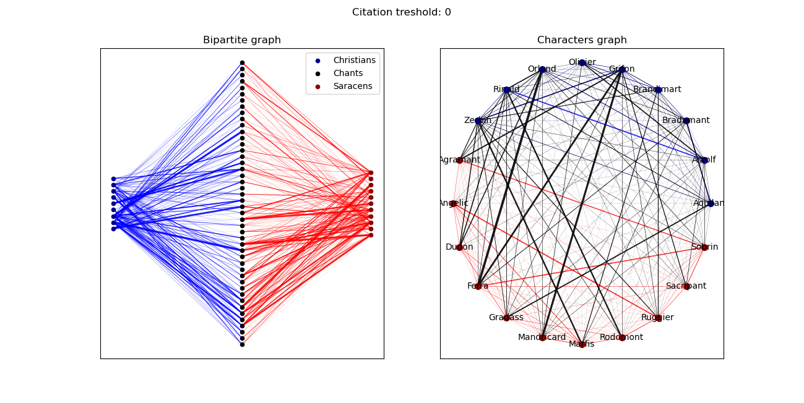
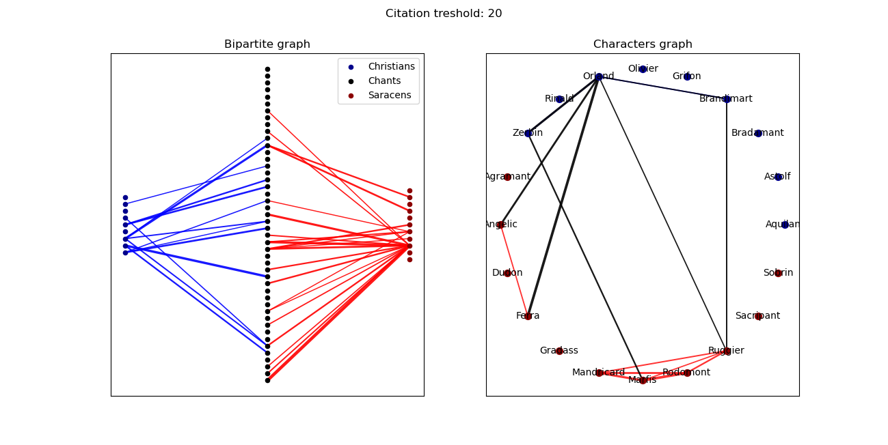

# Orlando Furioso Characters' Network
One of the masterpieces of the italian literature, the [Orlando Furioso](https://en.wikipedia.org/wiki/Orlando_Furioso) is an epic poem composed by [Ludovico Ariosto](https://en.wikipedia.org/wiki/Ludovico_Ariosto), published for the first time 
in the 1516 in Ferrara.  
Along 46 *canti* (chants) the great mind of Ariosto depicts with mastery the inner struggles that all the humans share, apart from their religion, gender and beliefs. As every great classic this poem deals with the weaknesses and the wishes that characterize everyone of us, despite all the 
layers of technology under which we like to hide. Mixing war and love, realism and fantasy, humor and tragedy for 38736 lines in total, Ariosto's work is one of the 
longest poem in European literature. Moreover, a wonderful case of textual data to pratice with.  
In this simple tool, the whole poem is analyzed focusing on the appearance of the various characters along the chapters. The results are displayed in a [network](https://en.wikipedia.org/wiki/Network_science) fashion.  
The **bipartite graph** has two sets of nodes with links between them, but not inside. The two groups are the 46 chants and the characters chosen for the analysis. The characters are divided into two subgroups in order to deepen the interpretation. The links between a character and a chapter is realized if the character is citated in that chapter. It's allowed to set a **citation threshold**: the link is realized only if the character appears in the chapter at least the chosen number of times.  
The **characters graph** is realized projecting the bipartite graph onto the characters set. In the projection, the nodes are the characters and a link between them is realized if they are linked to the same chapter in the bipartite graph. The minimum number of citation needed to link a character to a chapter has consequences on the projection.  
The following figure has been realized considering all the appearances of characters along the chapters (just a single reference to a character is enough for drawing a link to that chapter). The narrative skill of Ariosto is amazing and crystal clear: almost all the characters are citated all along the poem and the relations between them are rich and strictly tangled, indicating the great dynamism and compactness of the story.  
The same figure can be obtained running the following command from command line:  
```
pyhton Orlando_Furioso_network.py
```

  

The sintax for setting a citation threshold is the following:  
```
pyhton Orlando_Furioso_network.py -t 20
```
Output:  

  

Since 20 citations are needed by a character to be related to a chapter, the backbone of the relations is depicted. It's clear the central role of Orlando in the poem, the core of the Saracen warriors made up by Marfisa, Mandricardo, Rodomonte and Ruggiero, and the amorous triangle made up bu Orlando, Ferraù and Angelica.  

// ## Structure


